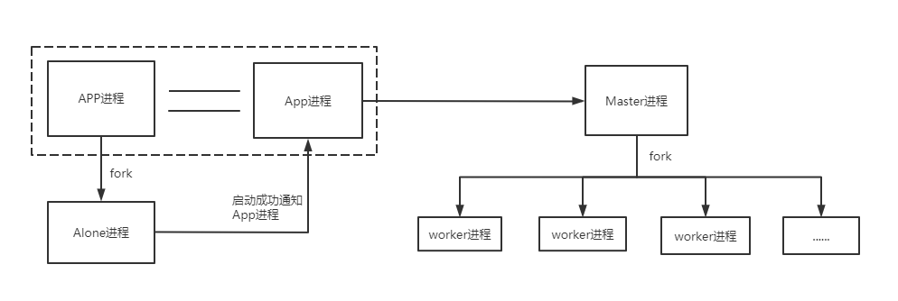
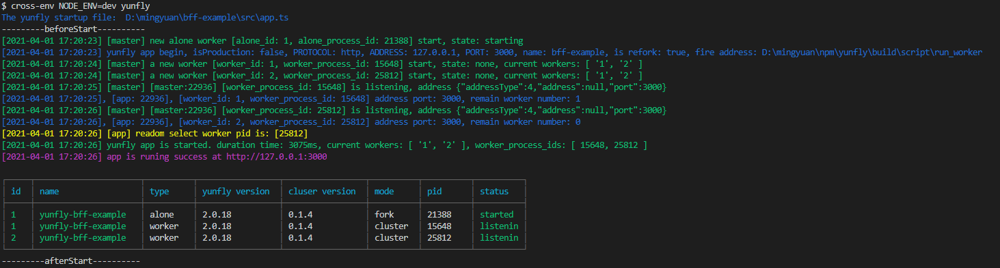
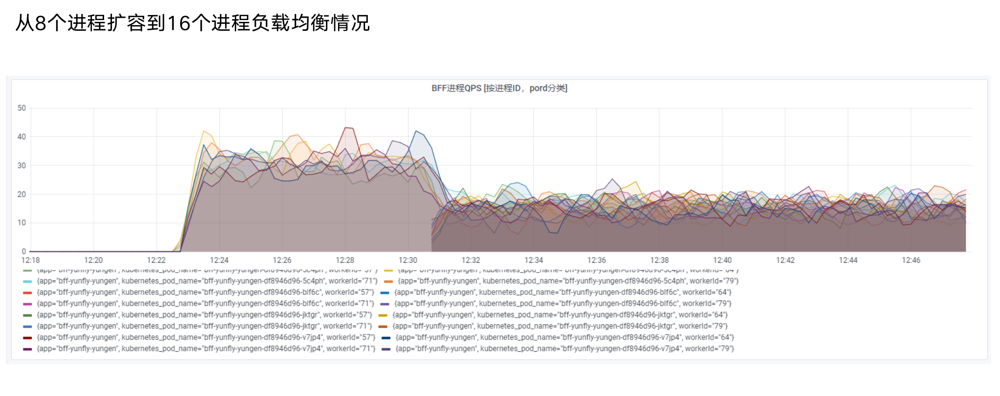

# 多进程模型

Node.js 进程只能运行在一个 CPU 上，无法充分利用多核CPU。
Node.js 官方提供cluster模块，Yunfly 框架内置 cluster 能力。

## cluster 是什么

1. 在服务器上同时启动多个进程
2. 每个进程里都跑的是同一份源代码
3. 这些进程可以同时监听一个端口

## 使用

`yunfly` 已内置 `cluster` 插件，只需进行开启即可。

```ts filename="src/config/config.default.ts"
config.cluster = {
  enable: true,
}
```

详细配置说明

| 字段 | 类型 | 必选 | 说明 |
| ------ | ------ |------ |------ |
| enable | `boolean` | 是 | 是否开启集群环境，不开启则保持以前状态 |
| useAloneWorker | `boolean` | 否 | 是否开启 alone 进程（默认：true） |
| count | `number` |  否 | worker进程数（默认开发环境1个进程，生产环自动获取docker容器的cpu核数） |
| env | `Object` |  否 | cluster进程能获取到的环境env变量，（默认 process.env） |
| title | `string` |  否 | cluster集群组名称 （默认： yunfly-{{package.name}}） |
| mode | `null \| test` |  否 | 运行模型，若值为test时，开发环境可自定义 count 数量 |

## 进程分类

`yunfly cluster` 参考了 `egg cluster` 模型理念，设计了 3 种分类。如下图：

```txt

                  ┌─────────────────────┐      ┌─────────────────────┐
                  │          master     │ ---- │        alone        │ 
                  └─────────────────────┘      └─────────────────────┘
                      /   /  |   \    \
                    /    /   |    \     \
                  /     /    |     \      \
                /      /     |      \       \
             /        /      |       \        \
           /         /       |        \         \
        /           /        |         \           \
┌───────┐    ┌───────┐     ┌───────┐  ┌───────┐   ┌───────┐ 
│ worker│    │ worker│     │ worker│  │ worker│   │ worker│   ......
└───────┘    └───────┘     └───────┘  └───────┘   └───────┘

```

### Master 进程

主要负责 worker 进程 alone 进程的启动。

### Worker 进程

Worker 进程负责处理真正的用户请求和定时任务的处理，Worker 运行的是业务代码，相对会比 Alone 和 Master 进程上运行的代码复杂度更高，稳定性也低一点，当 Worker 进程异常退出时，Master 进程会重启一个 Worker 进程。

### Alone 进程

1. alone 进程是由 child_process fork 出的一个子进程，`它比较稳定`，只有发生致命错误时才会退出进程。
2. 当 alone 发生致命错误导致退出后，会`重新 fork 一个新的 alone 进程继续执行任务`。
3. alone 进程比较适合处理一些需要在`单进程上运行的任务`， 例如定时接口的拉取，定时任务。
4. 当你不需要 alone 进程时你也可以选择不启动它，`config.cluster.useAloneWorker = false` 即可。

## alone 进程用法

由于 alone 进程比较特殊，这里说明一下 alone 用法。

* 在`根目录 src` 下面`创建 alone 文件夹`

* 在 `src/alone` 里面新增的文件都会在 `alone 进程中`执行

* 案例： 在alone进程中创建一个定时器任务

```ts filename="src/alone/setInterval.ts"

export default function Alone(config: any) {
  let i = 0
  setInterval(() => {
    console.log('console alone worker msg:', i++)
  }, 3000)
}
```

* 备注：

> 1. alone 文件夹下可以创建多个文件任务
> 2. 文件必须以函数形式进行导出

## Master VS Alone VS Worker

开启集群模式时，应用启动会启动这三类进程。

| 类型 | 进程数量 | 作用 | 稳定性 | 是否运行业务代码 |
| ------ | ------ |------ | ------ | ------ |
| Master | 1 | 进程管理，进程间消息转发 |  非常高 | 否  |
| Alone | 1 | 后台运行工作 |  高 | 少量  |
| Worker | n | 执行业务代码 | 一般  |  是 |

## 进程间通信

- 进程间通信支持两种模型
1. 通过 master 转发 alone 与 worker 之间的消息。
2. 通过进程间直连的 socket 进行消息传递（效率更高）。

### 进程间 socket 直连通信

框架内置 `cluster-client` 支持进程间 socket 直连模式。

#### worker 进程给 alone 进程发送消息

* 代码示例

worker 进程发送消息代码

```ts
const { getWorkerClient } = require('@yunflyjs/yunfly');
const client = getWorkerClient();

// 发送消息
getWorkerClient.publish({ key: 'worker-to-alone', value: 'from worker msg to alone process ' });
```

alone 进程接收消息代码

```ts
const { getAloneClient } = require('@yunflyjs/yunfly-cluster');
const client = getAloneClient();

client.subscribe({ key: 'worker-to-alone' }, (val: any) => {
  console.log(`Child_Process ${process.pid} client get val: ${val}, leader: ${client.isClusterClientLeader}`);
});
```

#### alone 进程给 worker 进程发送消息

* 代码示例

alone 进程发送消息代码

```ts
const { getAloneClient } = require('@yunflyjs/yunfly');
const client = getAloneClient();

// 发送消息
client.publish({ key: 'alone-to-worker', value: 'from alone msg to worker process' });
```

worker 进程接收消息代码

```ts
const { getWorkerClient } = require('@yunflyjs/yunfly-cluster');
const client = getWorkerClient();

client.subscribe({ key: 'alone-to-worker' }, (val: any) => {
  console.log(`Worker ${process.pid} client get val: ${val}, leader: ${client.isClusterClientLeader}`);
});
```

- socket 直连通信支持的api说明

| 字段 | 类型 | 说明 |
| ------ | ------ |------ |
| subscribe | `listener function` | 订阅函数 |
| publish | `fn` | 发送消息 |
| once | `listener function` | 订阅函数（只订阅一次）|
| unSubscribe | `fn` | 取消订阅 |
| close | `fn` | 关闭订阅 |

### 通过 master 进程转发通信
1. `worker` 进程是 node.js 模块中的 `cluster fork 出来的 worker 进程`，因此它可以和 master 进程进行通信
2. `alone` 进程是使用 node.js 模块中的 `child_process fork出来的worker进程`，因此它也可以和 master 进程进行通信
3. 因为进程间是独立的，worker 进程和 alone 进程也没有父子级关系，因此`它们之间不能相互通信`。要做到相互通信需要`通过 master 进程进行转发`，转发规则可看下面代码示例。

#### worker 进程给 alone 进程发送消息

* 代码示例

worker 进程发送消息代码

```ts
// worker 进程代码 发送消息
const sendmessage = require('sendmessage');

sendmessage(process,{
  action: 'worker-to-alone',
  from:'worker',
  to: 'alone',
  data: 'from worker msg to alone process'
})
```

alone 进程接收消息代码

```ts
// alone 进程代码 接受消息
process.on('message',(msg) => {
  const {action,from,to,data} = msg || {}
  if(action === 'worker-to-alone' && from === 'worker' && to === 'alone') {
    console.log('received msg from worker.msg:',msg)
  }
})
```

| 字段 | 类型 | 说明 |
| ------ | ------ |------ |
| action | `string` | 自定义事件名称（可随意自定义） |
| from | `string` | 值为 `worker`， 标识消息来源进程 |
| to | `string` | 值为 `alone`， 标识消息接收进程 |
| data | `any` | 发送的消息 |

#### alone 进程给 worker 进程发送消息

* 代码示例

alone 进程发送消息代码

```ts
// alone 进程代码 发送消息
const sendmessage = require('sendmessage');

sendmessage(process,{
  action: 'alone-to-worker',
  from:'alone',
  to: 'worker',
  type: 'worker',
  data: 'from alone msg to worker process'
})
```

worker 进程接收消息代码
```ts
// worker 进程代码 接受消息
process.on('message',(msg) => {
  const {action,from,to,data} = msg || {}
  if(action === 'alone-to-worker' && from === 'alone' && to === 'worker') {
    console.log('received msg from worker.msg:',msg)
  }
})
```

| 字段 | 类型 | 说明 |
| ------ | ------ |------ |
| action | `string` | 自定义事件名称（可随意自定义） |
| from | `string` | 值为 `alone`， 标识消息来源进程 |
| to | `string` | 值为 `worker`，标识接受进程 |
| type | `string` | 值为 `worker 或 all`，worker: 表示消息随机发送给一个worker进程， all: 表示消息发送给所有worker进程 （默认： worker） |
| data | `any` | 发送的消息 |

## 定时任务

在某些特殊场景下，我们只希望某些逻辑只运行在一个进程中（例如定时任务），yunfly 提供了两种方案来解决这种问题。

### 方案一： 使用随机的worker单进程运行任务

框架提供了单worker进程运行任务的能力，只需要在代码中监听 `random-select-worker` 事件即可：

```ts
// 代码案例
cluster.worker.on('message', (msg: AnyOptionConfig) => {
  const { from, to, action } = msg || {}
  if (
    from === 'app' &&                   // 确保是app进程发来的消息
    to === 'worker' &&                  // 确保是发给worker进程的
    action === 'random-select-worker'   // 确保是随机选择一个worker执行的事件
  ) {
    // 这里的任务会随机运行在一个worker进程中
    // 所以可以在这里执行定时任务
  }
})
```

### 方案二： 使用 alone 进程运行任务

在alone进程中运行的任务只会在一个进程中运行，它的概念本身就能满足我们的需求。

* [参考 Alone 进程使用方法](#alone-进程用法)

注意事项：

> 1. 由于进程之间是相互独立的，如果在alone进程执行的任务需要传递给worker进程，则需要做一些进程间通讯的操作。 [参考进程间通信](#进程间通信)

## 开发环境下的reload策略

> * 1、开发环境下，worker进程数始终为1，不能更改
> * 2、开发环境下，不启用refork功能 （即：worker异常退出之后不进行fork新的worker）
> * 3、开发环境reload模式下，只对worker进行进行reload，主进程master 和app进程不进行重启，减少重启耗时
> * 4、开发模式下，不停的更改文件时，触发机制有默认500毫秒的延迟时间，以防止不停重启（此时间可以调整： 配置 cluster.reloadDelay 即可）

## 附录

### cluster 时序图


### cluster启动模型图



### 服务稳定性保证


### cluster启动成功案例



### 多进程负债均衡图


